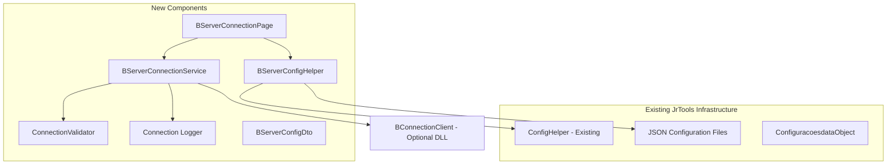

# Design Document: BServer Connection Tester

## Overview

The BServer Connection Tester is a new feature for the JrTools application that enables developers to test connectivity with BServer instances and dynamically discover available systems. This feature integrates seamlessly with existing JrTools configuration patterns while providing optional support for the Benner.Tecnologia.BServer.Clients.dll library.

The design follows the established JrTools architecture patterns, including:
- WinUI page-based navigation following the existing MainWindow navigation model
- Configuration persistence using JSON files in %LocalAppData%/JrTools directory
- Helper services for configuration management using async/await patterns
- Graceful error handling and user feedback through InfoBar components

Key architectural principles:
1. **Graceful degradation**: The feature works even when the BServer DLL is unavailable
2. **Configuration consistency**: Reuses existing DiretorioBinarios configuration and follows ConfigHelper patterns
3. **User experience continuity**: Integrates naturally into the existing JrTools navigation and styling
4. **Error resilience**: Comprehensive error handling for network, DLL, and configuration issues

## Architecture

The BServer Connection Tester follows a layered architecture that integrates with existing JrTools patterns:



### Architecture Layers

1. **UI Layer** (`BServerConnectionPage.xaml/cs`)
   - WinUI page following existing navigation patterns
   - Integrates with MainWindow navigation system
   - Follows established styling and layout conventions

2. **Service Layer** (`BServerConnectionService`)
   - Handles DLL loading using reflection
   - Manages connection lifecycle and system discovery
   - Provides abstraction over BConnectionClient

3. **Configuration Layer** (`BServerConfigHelper`)
   - Follows ConfigHelper and ConfiguracaoRelatoriosHelper patterns
   - Persists settings to JSON in %LocalAppData%/JrTools
   - Integrates with existing DiretorioBinarios configuration

4. **Data Transfer Layer** (`BServerConfigDto`)
   - Defines configuration data structure
   - Maintains connection history and settings

## Components and Interfaces

### BServerConnectionPage (UI Component)

**Purpose**: Main user interface for BServer connection testing

**Key Properties**:
- Server address input field with validation
- Port input field (default: 2000)
- Connection status indicator (Connected/Disconnected/Error)
- Available systems list display
- Test connection button with loading state

**Integration Points**:
- Follows existing JrTools WinUI page patterns
- Uses InfoBar for error/status messages (like ImportadorRelatoriosPage)
- Implements NavigationCacheMode.Required for persistence
- Integrates with MainWindow navigation system

### BServerConnectionService (Core Service)

**Purpose**: Manages BServer connectivity and DLL interaction

**Interface**:
```csharp
public class BServerConnectionService
{
    public async Task<ConnectionResult> TestConnectionAsync(string server, int port, int timeoutSeconds = 30);
    public async Task<string[]> GetAvailableSystemsAsync(string server, int port, int timeoutSeconds = 30);
    public bool IsDllAvailable { get; }
    public string DllStatus { get; }
    public event EventHandler<ConnectionStatusEventArgs> StatusChanged;
}
```

**Key Responsibilities**:
- Optional DLL loading using Assembly.LoadFrom with error handling
- BConnectionClient lifecycle management
- Connection timeout handling
- System discovery and caching (5-minute cache)
- Connection attempt queuing to prevent conflicts

### BServerConfigHelper (Configuration Service)

**Purpose**: Configuration persistence following JrTools patterns

**Interface**:
```csharp
public static class BServerConfigHelper
{
    public static async Task<BServerConfigDto> LerAsync();
    public static async Task SalvarAsync(BServerConfigDto config);
}
```

**Integration**:
- Follows ConfiguracaoRelatoriosHelper async/await pattern
- Uses JSON serialization with WriteIndented option
- Stores files in %LocalAppData%/JrTools directory
- Integrates with ConfigHelper for DiretorioBinarios access

### BServerConfigDto (Data Transfer Object)

**Purpose**: Configuration data structure

```csharp
public class BServerConfigDto
{
    public string ServerAddress { get; set; } = string.Empty;
    public int Port { get; set; } = 2000;
    public int TimeoutSeconds { get; set; } = 30;
    public List<string> RecentServers { get; set; } = new();
    public DateTime? LastConnectionAttempt { get; set; }
    public List<string> CachedSystems { get; set; } = new();
    public DateTime? SystemsCacheExpiry { get; set; }
}
```

### ConnectionValidator (Validation Service)

**Purpose**: Input validation and server address formatting

**Responsibilities**:
- Server address format validation (IPv4, hostname, FQDN)
- Port range validation (1-65535)
- Timeout range validation (1-300 seconds)
- Connection history management

## Data Models

### ConnectionResult

```csharp
public class ConnectionResult
{
    public bool IsSuccess { get; set; }
    public string ErrorMessage { get; set; } = string.Empty;
    public TimeSpan ConnectionTime { get; set; }
    public ConnectionErrorType ErrorType { get; set; }
    public string[] AvailableSystems { get; set; } = Array.Empty<string>();
}

public enum ConnectionErrorType
{
    None,
    DllNotFound,
    DllDependencyMissing,
    NetworkTimeout,
    ServerUnreachable,
    AuthenticationFailed,
    InvalidResponse,
    ValidationError
}
```

### ConnectionStatusEventArgs

```csharp
public class ConnectionStatusEventArgs : EventArgs
{
    public ConnectionStatus Status { get; set; }
    public string Message { get; set; } = string.Empty;
    public Exception? Exception { get; set; }
}

public enum ConnectionStatus
{
    Idle,
    Connecting,
    Connected,
    Disconnected,
    Error,
    DllUnavailable
}
```

## Testing Strategy

### Property-Based Testing Assessment

After analyzing the acceptance criteria, property-based testing is **not appropriate** for this feature. The BServer Connection Tester primarily involves:

1. **External Service Integration**: Testing BServer connectivity and system discovery
2. **Infrastructure as Code**: DLL loading, file system operations, and configuration management
3. **UI Components**: WinUI page rendering, error display, and user interactions  
4. **Side-Effect Operations**: Network connections, file persistence, and system integration

These types of operations are better tested through:
- **Unit tests** with mocked dependencies for business logic
- **Integration tests** for configuration persistence and DLL loading
- **UI tests** for component interaction and error display
- **Manual tests** for actual BServer connectivity scenarios

### Testing Strategy

## Error Handling

### Error Classification and Response Strategy

1. **DLL Loading Errors**
   - **DLL Not Found**: Display clear message with path information
   - **Dependency Missing**: Provide guidance for installing required components
   - **Access Denied**: Suggest running with appropriate permissions

2. **Network Connectivity Errors**
   - **Timeout**: Distinguish between connection timeout and server response timeout
   - **Unreachable**: Provide network troubleshooting guidance
   - **DNS Resolution**: Suggest checking server address format

3. **BServer Communication Errors**
   - **Authentication Failed**: Clear message about credentials or access rights
   - **Invalid Response**: Log technical details, show user-friendly message
   - **Protocol Errors**: Provide version compatibility information

4. **Configuration Errors**
   - **Invalid Server Address**: Real-time validation with format examples
   - **Invalid Port**: Range validation with helpful error messages
   - **Corrupted Config**: Automatic recreation with default values

### Error Recovery Mechanisms

- **Automatic Retry**: For transient network errors (with exponential backoff)
- **Configuration Reset**: When configuration files become corrupted
- **Cache Invalidation**: When system discovery returns unexpected results
- **DLL Reloading**: When DLL becomes available after initial failure

## Testing Strategy

### Unit Testing Approach

**Service Layer Testing** (with mocks):
- BServerConnectionService with mocked BConnectionClient
- ConnectionValidator input validation logic
- BServerConfigHelper configuration serialization
- Error handling for different failure scenarios

**Example Test Categories**:
- Connection validation with various server address formats
- Timeout handling behavior
- System discovery result processing
- Configuration persistence and retrieval
- Error message generation for different failure types

### Integration Testing Approach

**Configuration Integration**:
- JSON file persistence in LocalAppData directory
- Integration with existing ConfigHelper patterns
- Configuration file recovery from corruption

**Service Integration**:
- DLL loading behavior (with test DLLs)
- Connection lifecycle management
- System caching behavior

### UI Testing Approach

**Component Testing**:
- InfoBar error message display
- Input validation feedback
- Loading state management
- Navigation integration

### Manual Testing Scenarios

**Real BServer Testing**:
- Actual connectivity with BServer instances
- System discovery validation
- Network timeout scenarios
- DLL availability in different environments

### Test Configuration

**Unit Tests**: Standard NUnit/xUnit framework
- Focus on business logic validation
- Mock external dependencies (BConnectionClient, file system)
- Validate error handling paths

**Integration Tests**: 
- Use temporary directories for configuration testing
- Test with sample DLL files
- Validate with controlled network scenarios

**UI Tests**: 
- WinUI test framework
- Component interaction validation
- Visual state verification

The testing approach emphasizes reliable business logic validation while acknowledging that BServer connectivity requires manual verification in real environments.