GUIA_DE_USO

# JrTools — Guia de Uso (Usuário)

Este guia explica **como usar o aplicativo** no dia a dia, em linguagem de usuário final.

## Primeiros passos (recomendado)

- **1) Abra “Configurações”**
- - 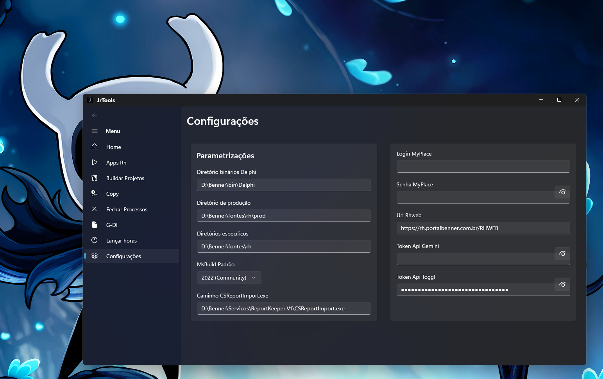
  - No menu lateral, clique em **Configurações**.
  - Preencha (ou revise) os campos:
    - **Diretório binários Delphi**
    - **Diretório de produção**
    - **Diretórios específicos**
    - **MSBuild Padrão**
    - **Caminho CSReportImport.exe**
  - Em **dados pessoais**, configure:
    - **Token API Gemini** (necessário para a página **G-DI / Documentador**)
    - **Token API Toggl** (necessário para **Lançar horas** e para o indicador do **Home**)
    - Login/senha/URL do RHWEB (se aplicável no seu ambiente)
- **2) Volte ao “Home”**
  - No menu lateral, clique em **Home** para ver o Dashboard e utilitários.

## Menu lateral (o que cada opção faz)

### Home (Dashboard)

Use quando quiser ver um resumo rápido e utilitários do dia.

- **Banco de Horas**: mostra seu saldo consultando o RH.
- **Previsão de Saída (Hoje)**: estima seu horário de saída com base nas marcações do dia.
- **Horas lançadas hoje (Toggl)**: soma as horas já registradas hoje no Toggl (precisa do token).
- **Calculadora de Horas**:
  - Ajuste **Entrada 1 / Saída 1 / Entrada 2 / Saída 2**.
  - Clique em **Calcular** para ver o total.
- **Manter processos fechados**:
  - Dentro do Home existe um bloco/expander que carrega a tela de **Fechar Processos** para você controlar o “auto-kill”.

### Apps RH (Central de RH)

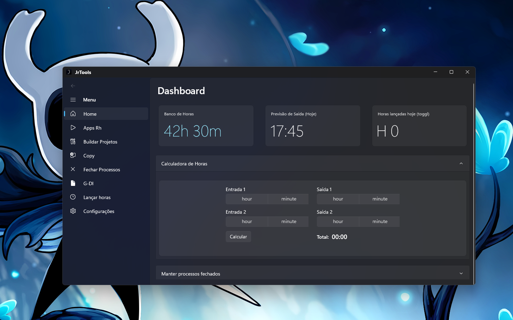

Use como “hub” para abrir as automações de RH. As opções aparecem em sequência; abaixo está o **mesmo fluxo, na mesma ordem**.

#### 1) Projetos RH (Subir ambiente Prod)

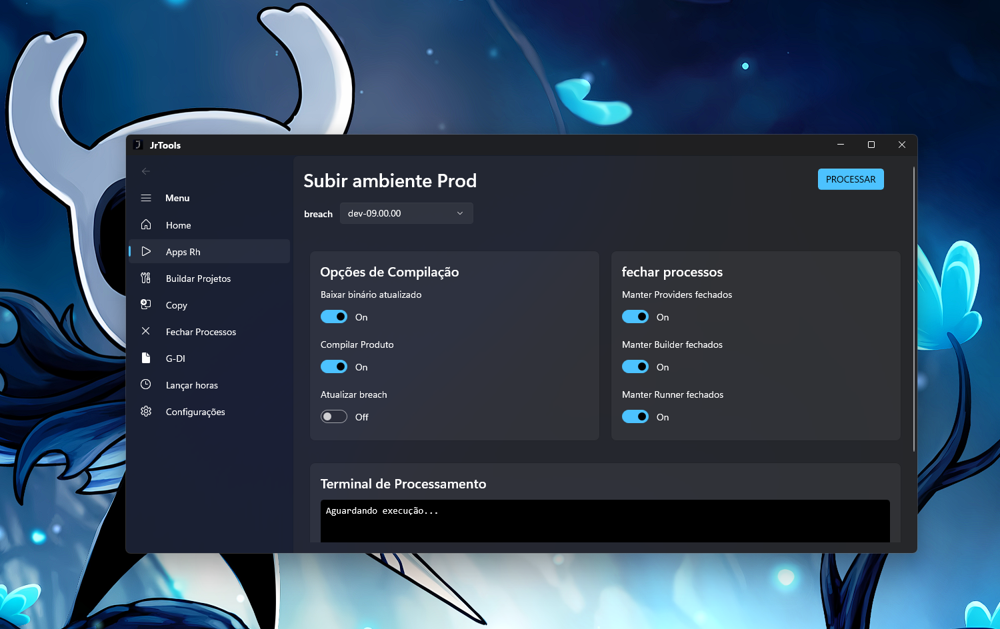

Objetivo: rodar um fluxo automatizado para preparar/subir o ambiente “Prod” e abrir o resultado no navegador.

- **Como usar**
  - Em **Apps RH**, clique em **Projetos RH**.
  - Selecione uma opção na lista (ex.: `producao_09.00`, `dev-08.06.00` etc.).
  - Se escolher **Outro**:
    - Preencha o campo **Branch**.
    - Ajuste **Build/Tag** se necessário.
  - Ajuste as opções:
    - **Baixar binário atualizado**
    - **Compilar Produto**
    - **Atualizar branch** (pull/atualização)
  - Clique em **PROCESSAR**.
  - Acompanhe o **Terminal de Processamento** na própria página.
- **O que esperar**
  - O app tenta manter alguns processos fechados durante a execução (para evitar travamentos).
  - Ao finalizar com sucesso, ele tenta abrir `http://localhost/prod` automaticamente.

#### 2) Cria

Objetivo: executar o aplicativo externo **Cria.exe** e mostrar a saída em um painel de logs.

- **Como usar**
  - Em **Apps RH**, clique em **Cria**.
  - A execução inicia automaticamente ao abrir a página.
  - Acompanhe os logs no painel.
- **Observações**
  - Se o executável não existir no caminho esperado, a página vai registrar erro no log.
  - Ao sair da página, o processo é encerrado.

#### 3) Cria Fix

Objetivo (pela UI): corrigir arquivos (descrição cita UTF8-BOM). Comportamento atual: executa o mesmo fluxo do **Cria** (roda `Cria.exe` e registra logs).

- **Como usar**
  - Em **Apps RH**, clique em **Cria Fix**.
  - A execução inicia automaticamente ao abrir a página.

#### 4) Ambiente Específico

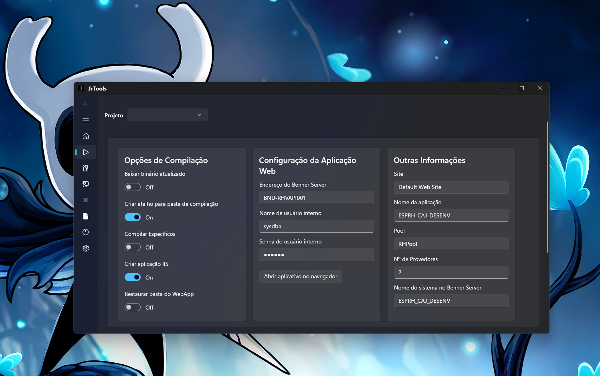

Objetivo: preparar/subir um ambiente específico com várias opções de execução e parâmetros.

- **Como usar (pela tela)**
  - Em **Apps RH**, clique em **Ambiente Específico**.
  - Selecione o **Projeto**.
  - Marque/desmarque as opções conforme necessário:
    - Baixar binário
    - Compilar específicos
    - Criar aplicação IIS
    - Restaurar WebApp
    - Criar atalho etc.
  - Preencha os parâmetros (servidor/usuário/senha/site/aplicação/pool/provedores).
  - Clique em **PROCESSAR** e acompanhe o **terminal**.
- **Importante**
  - Esta tela está presente no app, e prepara o ambiente para compilação e execução de projetos específicos.

#### 5) Importador de Relatórios

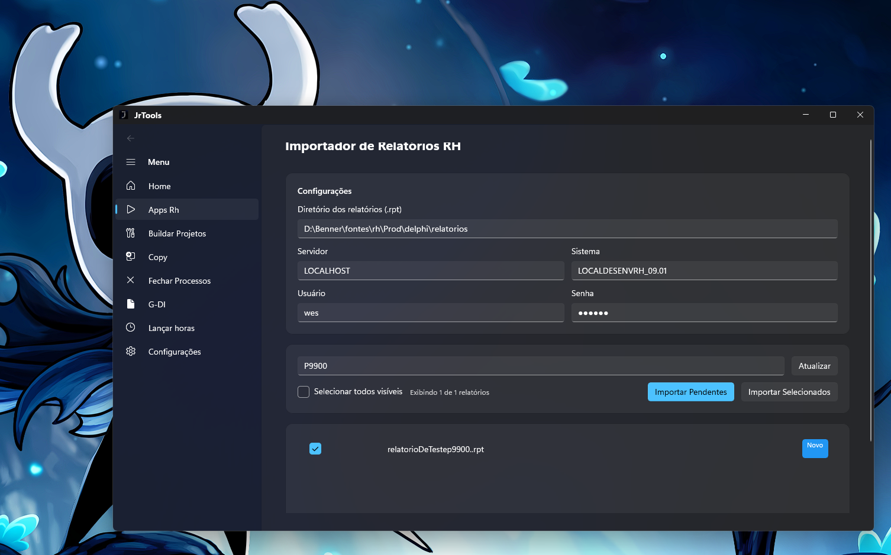

Objetivo: importar relatórios **.rpt** para o servidor Benner usando o `CSReportImport.exe`.

- **Como usar**
  - Em **Apps RH**, clique em **Importador de Relatórios**.
  - Na área **Configurações**, preencha:
    - **Diretório dos relatórios (.rpt)**
    - **Servidor**, **Sistema**
    - **Usuário** e **Senha**
  - Use a busca **Buscar relatório...** para filtrar.
  - Opções de seleção:
    - **Selecionar todos visíveis**
  - Importação:
    - **Importar Pendentes** (novos/diferentes)
    - **Importar Selecionados** (somente marcados)
  - Acompanhe:
    - **Progresso** (barra)
    - **Log de execução**
-

### Buildar Projetos

Objetivo: buildar soluções .NET ou projetos Delphi a partir de diretórios configurados.

#### Build .NET

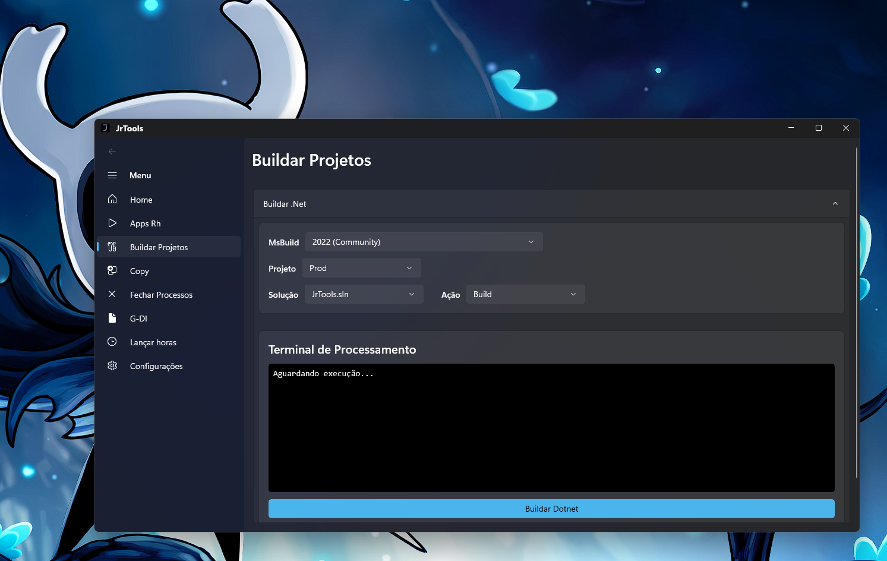

- **Como usar**
  - Selecione o **MSBuild**.
  - Selecione o **Projeto** (pasta).
  - Selecione a **Solução (.sln)**.
  - Selecione a **Ação**: Build/Limpar/Rebuild.
  - Clique em **Buildar Dotnet**.
  - Acompanhe o **Terminal de Processamento**.

#### Build Delphi

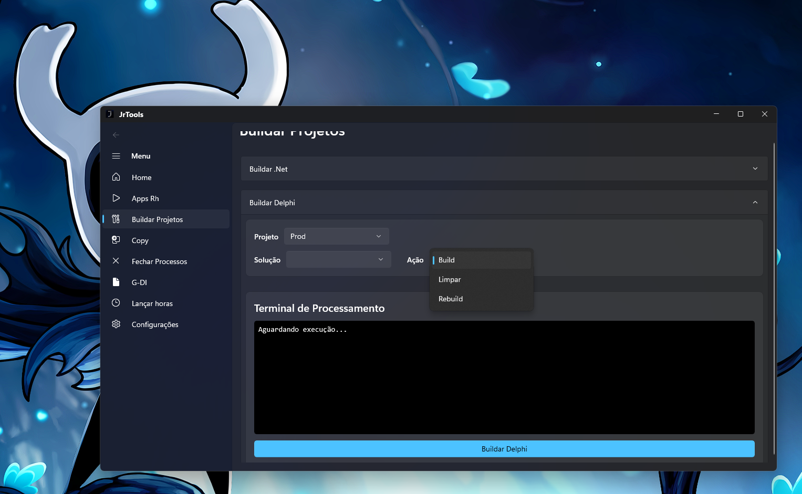

- **Como usar**
  - Selecione o **Projeto** (pasta).
  - Selecione a **Solução Delphi**.
  - Selecione a **Ação**.
  - Clique em **Buildar Delphi** e acompanhe o terminal.

### Copy (Espelhador de Pastas)

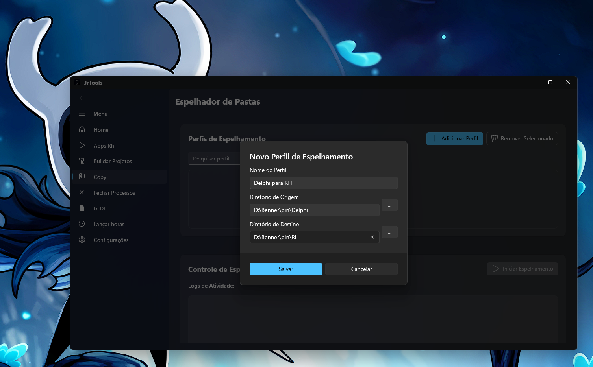

Objetivo: manter pastas “espelhadas” com base em perfis (origem → destino).

- **Como usar**
- 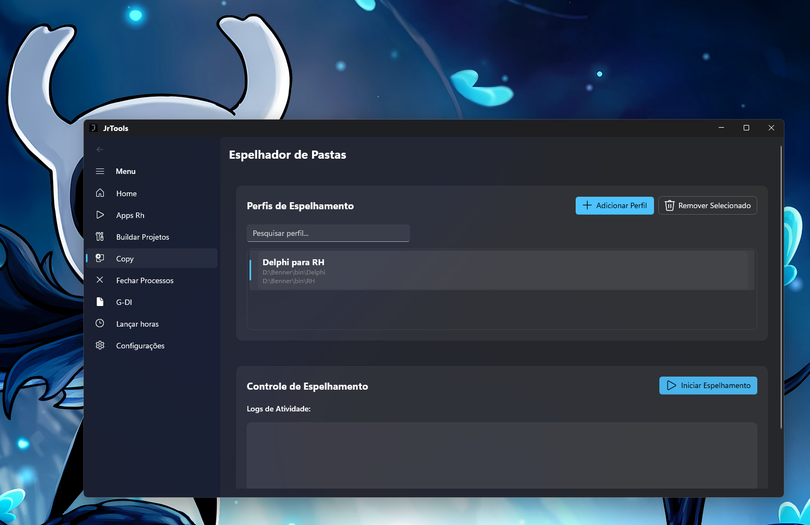
  - Clique em **Adicionar Perfil** e preencha:
    - Nome do perfil
    - Diretório de origem
    - Diretório de destino
  - Selecione um perfil na lista.
  - Clique em **Iniciar Espelhamento**.
  - Acompanhe:
    - Logs
    - Painel de progresso (quando ativo)
- **Parar**
  - Clique em **Parar Espelhamento**.

### Fechar Processos

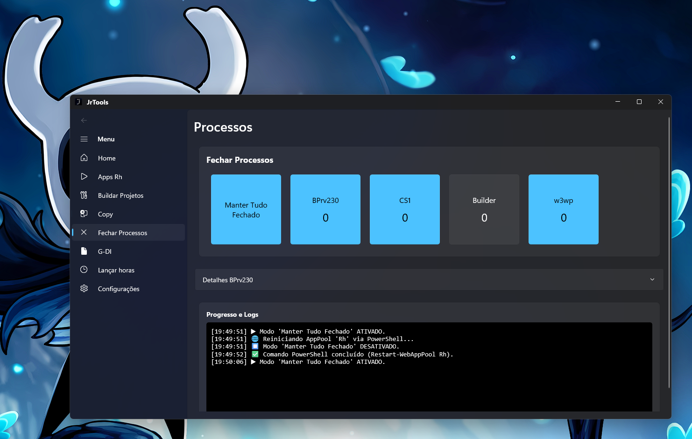

Objetivo: manter alguns processos fechados automaticamente e visualizar detalhes.

- **Como usar**
  - Ative/desative o controle geral (**MASTER**) para ligar/desligar o “auto-kill”.
  - Ative/desative cada processo individualmente.
  - Em **Detalhes**, confira a lista de processos e use **Encerrar Individual** se necessário.
  - Acompanhe **Progresso e Logs** no terminal da página.

### G-DI (Documentador)

Objetivo: gerar documentação a partir de um **commit** e um **prompt**, usando IA (Gemini), e exportar.

- **Pré-requisito**
  - Configure o **Token API Gemini** em **Configurações**.
- **Como usar**
  - Informe o **ID do commit (SHA)**.
  - Preencha o **Prompt adicional** (o que você quer que a IA gere).
  - Opcional: clique em **Anexar** para enviar um arquivo (pdf/doc/docx/txt) para análise.
  - Clique em **Gerar Documentação**.
  - Use:
    - **Copiar** para copiar com formatação
    - **Exportar DOC** para salvar em `.docx`

### Lançar horas

!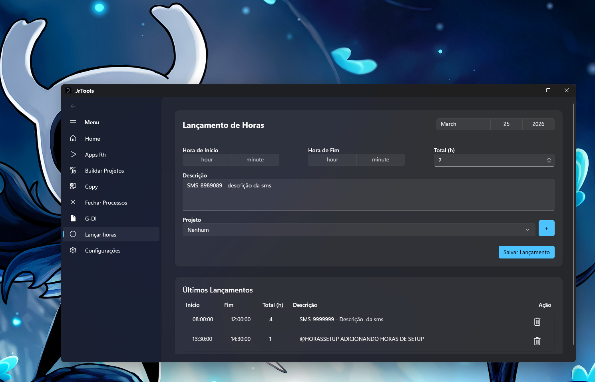

Objetivo: registrar, editar e excluir lançamentos de horas do dia no Toggl.

- **Pré-requisito**
  - Configure o **Token API Toggl** em **Configurações**.
- **Como usar**
  - Selecione o **dia**.
  - Preencha:
    - Hora de início/fim (opcional) e/ou total de horas
    - Descrição
    - Projeto
  - Clique em **Salvar Lançamento**.
  - Para editar:
    - Selecione um lançamento na lista → ajuste campos → **Salvar Alterações**
  - Para excluir:
    - Clique no ícone de lixeira no item.

## Observações finais

- Algumas funcionalidades dependem fortemente de **caminhos locais** e de **tokens** (Gemini/Toggl). Se algo não acontecer, comece revisando **Configurações**.
- A tela **Chat** existe no projeto, mas não aparece no menu principal e não tem lógica de envio documentada no repositório.
