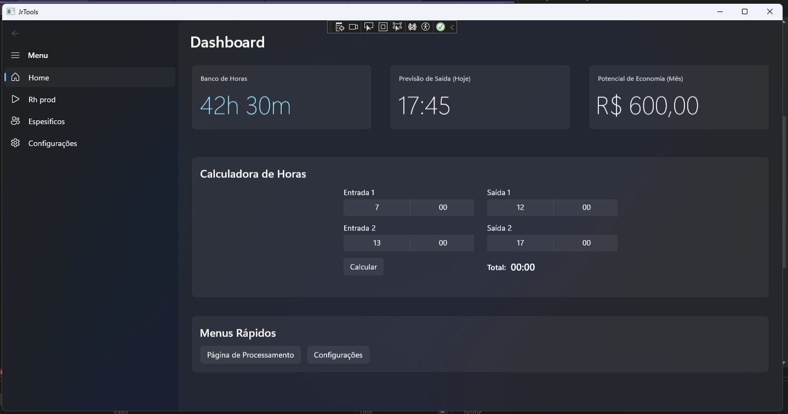

# JrTools: Uma Ferramenta Essencial para o Desenvolvimento Benner

💻 Sobre o Projeto

JrTools é um aplicativo Windows desenvolvido em C# com WinUI 3 para uso exclusivo da equipe de desenvolvimento da 

## ✨ Funcionalidades

O aplicativo foi projetado para resolver os desafios do nosso dia a dia, tornando o trabalho com diferentes versões e bases de dados mais rápido e eficiente.

Dashboard de Produtividade:
Gerencie suas horas de trabalho, controle horas extras e o seu banco de horas de forma simples e visual. A dashboard te dá uma visão clara do seu saldo de horas e da sua jornada diária.

Automação de Ambientes e Versões:

Troca de Branches: Mude de branches de forma automática, economizando tempo e garantindo que você esteja no ambiente correto para o trabalho.

Atualização de Código e Binários: Sincronize o código mais recente com `Git Pull`  e atualize automaticamente os binários dos projetos. O aplicativo busca as versões mais novas e as coloca nas suas pastas de trabalho, garantindo que você sempre tenha o ambiente mais atualizado.

Build de Projetos Simplificado:

Compilação Automatizada: Com um único clique, compile projetos complexos, tanto em C# quanto em Delphi, como a solução `Compilacao_Completa_SemWebApp.sln`. A ferramenta cuida de todo o processo, eliminando a necessidade de builds manuais e demorados.

⚙️ Como Funciona (para o Desenvolvedor)

## importante!
Este é um aplicativo interno. As instruções detalhadas para instalação e configuração serão fornecidas pela equipe de TI.
#### 🔒 Aviso de Uso
Este aplicativo é de uso exclusivo para os colaboradores sendo nao ira funcionar em ambiente externo.

 
## Stack utilizada

**Frameworks:** .NET 6 ou superior, WinUI 3

**Sistema Operacional** Windows 10/11

## Screenshots

